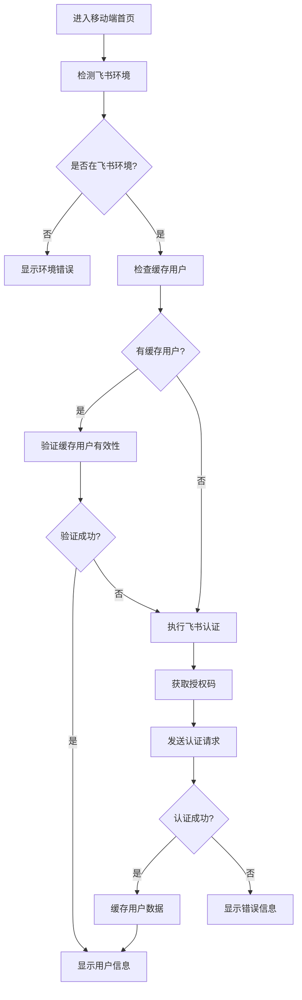
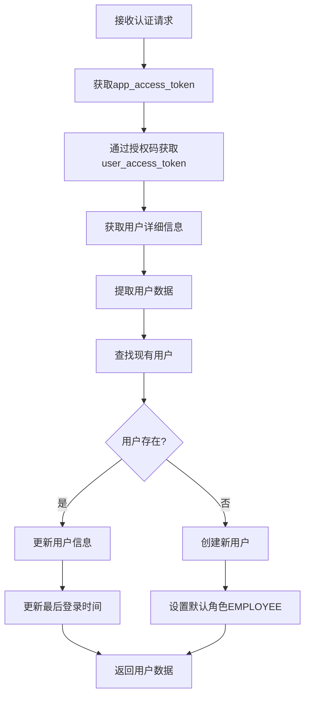

# 飞书认证和用户自动注册流程优化方案

## 1. 当前架构分析

### 1.1 前端架构

#### useFeishuAuth Hook (核心认证逻辑)
- **位置**: `src/hooks/useFeishuAuth.ts`
- **功能**: 统一处理飞书环境检测、用户认证和状态管理
- **关键特性**:
  - 飞书环境检测 (`checkFeishuEnvironment`)
  - 用户数据缓存 (`loadCachedUser`)
  - 自动认证流程 (`performFeishuAuth`)
  - 错误处理和重试机制
  - 状态管理 (loading, error, authenticating)

#### 移动端首页集成
- **位置**: `src/pages/mobile/MobileHomePage.tsx`
- **集成方式**: 使用 `useFeishuAuth` hook
- **状态处理**: 环境检测、认证加载、错误显示

### 1.2 后端架构

#### 飞书认证控制器
- **位置**: `express/controllers/feishuController.js`
- **认证流程**:
  1. 获取 app_access_token
  2. 通过授权码获取 user_access_token
  3. 获取用户详细信息
  4. 调用用户匹配/注册逻辑

#### 用户模型和自动注册
- **位置**: `express/models/User.js`
- **核心方法**: `findOrCreateByFeishuId`
- **注册逻辑**:
  - 根据 `feishuUserId` 查找现有用户
  - 存在则更新信息和登录时间
  - 不存在则创建新用户（默认角色：EMPLOYEE）

#### 认证中间件
- **位置**: `express/middleware/authMiddleware.js`
- **功能**: 验证用户身份，获取角色权限和业务数据
- **支持**: 飞书用户认证 + 开发模式模拟用户

## 2. 飞书环境检测逻辑

### 2.1 检测机制
```typescript
const checkFeishuEnvironment = (): Promise<boolean> => {
  return new Promise((resolve) => {
    let checks = 0;
    const maxChecks = 20; // 最多检查10秒
    
    const checkInterval = setInterval(() => {
      if (window.h5sdk && window.tt) {
        clearInterval(checkInterval);
        console.log('Feishu SDK detected');
        resolve(true);
      } else {
        checks++;
        if (checks >= maxChecks) {
          clearInterval(checkInterval);
          console.log('Feishu SDK not detected after timeout');
          resolve(false);
        }
      }
    }, 500);
  });
};
```

### 2.2 检测特点
- **轮询检测**: 每500ms检查一次，最多检查10秒
- **SDK依赖**: 检测 `window.h5sdk` 和 `window.tt` 对象
- **超时处理**: 10秒后自动停止检测
- **状态管理**: `checkingEnv` 状态控制UI显示

## 3. 用户认证和自动注册流程

### 3.1 前端认证流程


### 3.2 后端认证和注册流程


### 3.3 用户数据结构
```typescript
interface FeishuUser {
  userId: string;        // 飞书用户ID (open_id)
  name: string;          // 用户姓名
  email?: string;        // 邮箱
  avatar?: string;       // 头像URL
  role: string;          // 用户角色
  storeId?: string;      // 关联门店ID
  storeName?: string;    // 门店名称
  permissions: string[]; // 权限列表
  isNewUser?: boolean;   // 是否新注册用户
}
```

## 4. 业务数据获取和角色权限管理

### 4.1 认证中间件处理
```javascript
// 设置请求上下文
req.user = {
  _id: user._id,
  feishuUserId: user.feishuUserId,
  name: user.name,
  email: user.email,
  role: user.role,
  storeId: user.storeId,
  currentStoreId: req.currentStoreId,
  permissions: user.permissions || [],
  isAdmin: user.isAdmin(),
  isManager: user.isManager()
};
```

### 4.2 角色权限体系
- **ADMIN**: 系统管理员，拥有所有权限
- **MANAGER**: 门店管理员，管理特定门店
- **EMPLOYEE**: 普通员工，基础操作权限

### 4.3 权限检查方法
```javascript
// 用户模型实例方法
userSchema.methods.hasPermission = function(permission) {
  return this.permissions.includes(permission) || this.isAdmin();
};

userSchema.methods.isAdmin = function() {
  return this.role === USER_ROLES.ADMIN;
};

userSchema.methods.isManager = function() {
  return this.role === USER_ROLES.MANAGER;
};
```

## 5. 优化建议

### 5.1 前端优化

#### 5.1.1 环境检测优化
- **建议**: 减少检测频率，优化性能
- **实现**: 将检测间隔从500ms调整为1000ms
- **超时优化**: 根据实际网络情况调整超时时间

#### 5.1.2 缓存策略优化
- **建议**: 增加缓存过期机制
- **实现**: 为缓存数据添加时间戳，定期清理过期缓存
- **安全性**: 敏感信息不缓存到localStorage

#### 5.1.3 错误处理优化
- **建议**: 细化错误类型，提供更友好的错误提示
- **实现**: 区分网络错误、认证错误、权限错误等

### 5.2 后端优化

#### 5.2.1 认证流程优化
- **建议**: 增加请求重试机制
- **实现**: 对飞书API调用添加指数退避重试
- **监控**: 添加认证成功率监控

#### 5.2.2 用户数据同步
- **建议**: 定期同步飞书用户信息
- **实现**: 创建定时任务，批量更新用户信息
- **增量更新**: 只更新变化的用户数据

#### 5.2.3 权限管理优化
- **建议**: 实现细粒度权限控制
- **实现**: 基于资源和操作的权限模型
- **动态权限**: 支持运行时权限变更

### 5.3 安全性优化

#### 5.3.1 Token管理
- **建议**: 实现Token刷新机制
- **实现**: 定期刷新飞书access_token
- **安全存储**: 敏感Token存储在HttpOnly Cookie中

#### 5.3.2 请求验证
- **建议**: 增加请求签名验证
- **实现**: 对关键API请求添加HMAC签名
- **防重放**: 添加时间戳和nonce防重放攻击

## 6. 实施计划

### 阶段一：基础优化 (1-2周)
1. 优化环境检测逻辑
2. 完善错误处理机制
3. 增加缓存过期策略

### 阶段二：功能增强 (2-3周)
1. 实现用户数据同步机制
2. 优化权限管理系统
3. 添加认证监控和日志

### 阶段三：安全加固 (1-2周)
1. 实现Token刷新机制
2. 添加请求签名验证
3. 安全性测试和漏洞修复

## 7. 监控和维护

### 7.1 关键指标
- 认证成功率
- 认证响应时间
- 用户注册转化率
- 错误率分布

### 7.2 日志记录
- 认证请求日志
- 用户操作日志
- 错误和异常日志
- 性能监控日志

### 7.3 告警机制
- 认证失败率过高告警
- API响应时间过长告警
- 系统异常告警

---

**文档版本**: v1.0  
**创建时间**: 2024年1月  
**维护人员**: 开发团队  
**更新频率**: 月度更新